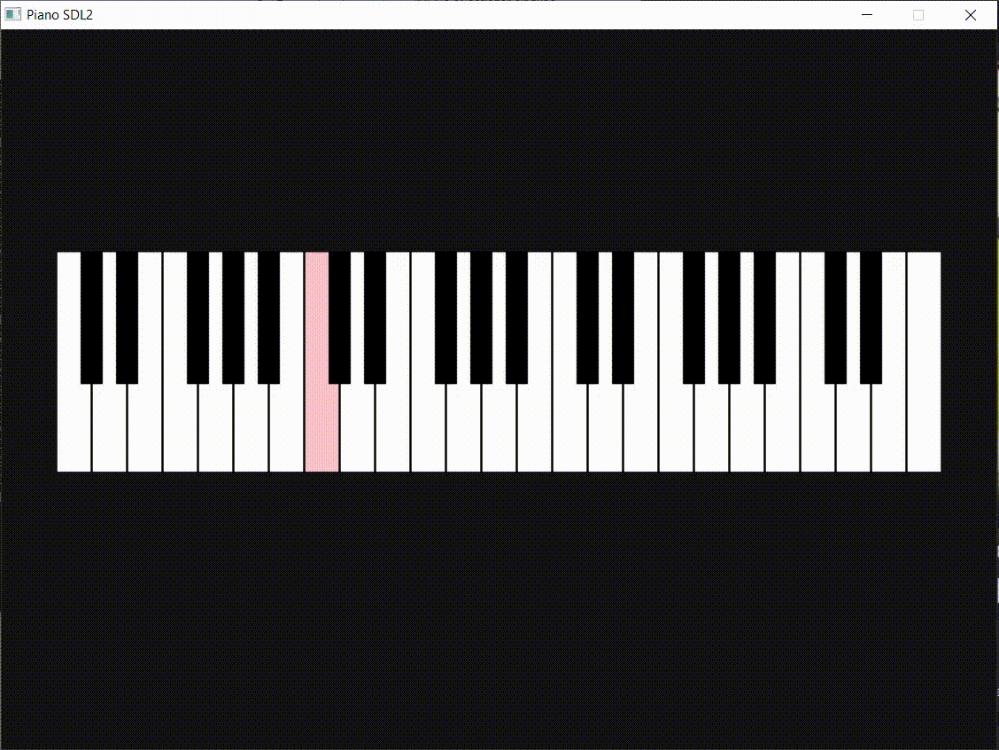

# Piano de 42 Teclas con SDL2 en C++ 

Un simulador de piano interactivo con 42 teclas, utilizando **SDL2** para renderizado gráfico, manejo de inputs (teclado/ratón) y reproducción de sonidos.  

 *Interfaz del Piano*  

## Características Principales  
- Interfaz sencilla con menú de inicio y piano interactivo.  
- 42 teclas sensibles a **eventos de teclado y ratón**.  
- Efecto visual al presionar teclas (cambio de color con delay).  
- Sonidos realistas de piano (archivos `.mp3` o `.wav`).  
- Código estructurado con **POO** (Ej: `PianoKey.cpp` en `core/engine/`).  

```cpp
// PlayState.cpp
// Constructor
PlayState::PlayState(StateManager& manager)
    : stateManager(manager), piano(50, 200) { 
}

void PlayState::enter() {
    // Cargar recursos al entrar al estado
    if (!textRender.loadFont("assets/fonts/arial.ttf", 36)) {
        throw std::runtime_error("No se pudo cargar la fuente en PlayState");
    }
}

void PlayState::exit() {
    // Liberar recursos específicos del estado
}

void PlayState::update(float deltaTime) {
    piano.update();
}

void PlayState::render(Window& window) {
    window.clear();
    
    piano.render(window.getRenderer());

    window.present();
}

void PlayState::handleEvents(EventHandler& eventHandler) {
    piano.handleEvents(eventHandler);

    if (eventHandler.isKeyPressed(SDL_SCANCODE_LEFTBRACKET)) {
        stateManager.submitRequest(StateRequest{
            RequestPushState{std::make_unique<PauseState>(stateManager)}
        });
    }
    
    if (eventHandler.isKeyPressed(SDL_SCANCODE_SEMICOLON)) {
        stateManager.submitRequest(StateRequest{
            RequestChangeState{std::make_unique<MenuState>(stateManager)}
        });
    }
}
```
## Tecnologías Usadas
- **C++** (Programación orientada a objetos)
- **SDL2** (Bibliotecas):
  - SDL.h (renderizado gráfico)
  - SDL_mixer (reproducción de audio)
  - SDL_ttf (renderizado de fuentes)

## Instalación y Uso

### Requisitos
- MSYS2 (entorno de compilación para Windows)
- Paquetes SDL2:
  ```bash
  pacman -S mingw-w64-ucrt-x86_64-SDL2 mingw-w64-ucrt-x86_64-SDL2_mixer mingw-w64-ucrt-x86_64-SDL2_ttf
## Compilación

1. Clona el repositorio:
```bash
git clone https://github.com/tu-usuario/piano-sdl2.git
```

### Compila con Cmake

```bash
cd pianoSDL2/build
cmake -G "MinGW Makefiles" ..
mingw32-make
```

luego ejecuta el programa.

## Assets Necesarios
Descarga los sonidos de piano desde el siguiente enlace [github.com/fuhton/piano-mp3](https://github.com/fuhton/piano-mp3) y colocarlos en: assets/sounds 

Las fuentes TTF deben ubicarse en: assets/ fonts

## Issues Conocidos
- **Problema visual**: Las teclas no siempre recuperan su color original después de ser presionadas, especificamente cuando presionas multiples teclas al mismo tiempo.
- **Audio**: Se saturan los canales al presionar varias teclas de forma rapida, debido a que no se libera un canal a tiempo.
- Contribuciones para optimizar estos aspectos son bienvenidas.

## 📜 Licencia
[](https://www.gnu.org/licenses/gpl-3.0)  
🔓 **Código abierto**: Cualquier derivado de este proyecto debe mantenerse bajo la misma licencia

## 🤝 Cómo Contribuir
1. Haz un fork del repositorio
2. Crea una rama para tus cambios:
```bash
git checkout -b mi-mejora